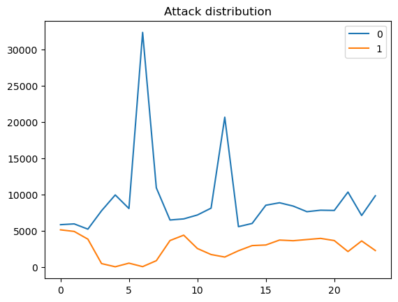
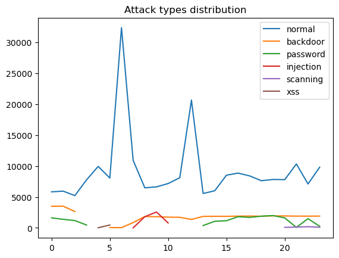
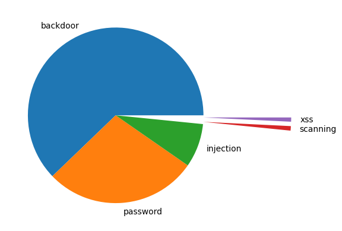

# IoT Network Attack or Anomaly Detection

## Introduction
### Background
In recent years, there has been a significant increase in the use of Internet of Things (IoT) devices in Australia, ranging from simple household appliances like smart furniture and lighting systems to complex machinery and industrial equipment. With the proliferation of IoT, network attacks and anomalies have increasingly come under scrutiny. Especially, the recent network security incidents involving Australian companies have highlighted the importance of attack or anomaly detection. The IoT refers to a network of physical devices, vehicles, and home appliances embedded with sensors, software, and connectivity capabilities, which can collect and exchange data without direct human intervention and communicate through the internet or other networks.

With the development of IoT, fog computing has emerged as an important concept, providing computing and storage services at the edge of the network. Fog computing processes data close to the data source, reducing the burden on centralized cloud computing and enhancing the speed and efficiency of data processing. This is particularly applicable to real-time data analysis and processing, playing a significant role in data management and security monitoring within IoT environments.

### Problem Statement
1. IoT devices typically have limited performance, meaning their computational capabilities are restricted or lack the capacity to process data. Therefore, it is necessary to develop models that can run on these limited-performance devices or local routers or servers based on fog computing, to facilitate automatic monitoring of network attacks or anomalies.
2. Our exploratory data analysis (EDA) has found that network attacks and abnormal traffic have periodic occurrences at different times. This finding indicates the importance of time series models for automatic network security monitoring. Currently, most related research and work have not integrated time series models into IoT network security monitoring, whereas their introduction can significantly enhance the robustness of future event predictions.

### Team Contributions
1. We successfully deployed and ran the model on a Raspberry Pi, simulating the performance in resource-limited IoT devices or local routers or servers based on fog computing environments.
2. Through [quantization](https://arxiv.org/abs/2103.13630) processing and the application of [width multipliers](https://arxiv.org/abs/1704.04861), we enabled the Raspberry Pi to efficiently run a lightweight recurrent neural network (RNN) model.
3. We developed a lightweight RNN model integrated with LSTM units, used for detecting network attacks and abnormal traffic, providing accurate detection capabilities while maintaining high efficiency.
4. To draw comparisons, we designed a lightweight Multilayer Perceptron (MLP) model as a baseline. The results showed that the lightweight RNN model with LSTM units is more robust than MLP model in detecting future data.

## Environment Requirements
### Training Environment
- Python == 3.10
- PyTorch == 2.0.1
- Pandas == 1.5.3
- Numpy == 1.24.3
- Scikit-learn == 1.3.0
- Matplotlib == 3.7.1
- tqdm == 4.65.0

### Raspberry Pi Inference Environment
- Python == 3.9
- PyTorch == 2.2.0.dev20231120
- Pandas == 2.1.3
- Numpy == 1.26.2
- tqdm == 4.65.0

### Training System
- Apple M1 Pro 32G
- 14.1.1 (23B81)

### Raspberry Pi System
- Raspberry Pi 4 Model B 2GB
- Linux raspberrypi 6.1.0-rpi6-rpi-v8 #1 SMP PREEMPT Debian 1:6.1.58-1+rpt2 (2023-10-27) aarch64 GNU/Linux

## Dataset

IoT datasets were logged in log and CSV files, where Modbus sensors were used to capture their telemetry data.

### Description Of Features

1.  `date`: Date of logging IoT telemetry data
2.  `time`: Time of logging IoT telemetry data
3.  `FC1_Read_Input_Register`: Modbus function code that is responsible for reading an input register 
4.  `FC2_Read_Discrete_Value`: Modbus function code that is in charge of  reading a discrete value 
5. `FC3_Read_Holding_Register`: Modbus function code that is responsible for reading a holding register 
6. `FC4_Read_Coil`: Modbus function code that is responsible for reading a coil 
7. `label`: Tag normal and attack records, where 0 indicates normal and 1 indicates attacks  
8. `type`:  Tag attack categories, such as normal, DoS, DDoS and backdoor attacks, and normal records 

## Data Visualisation

As shown in the graph, there are two lines that represent the times the IOT device has been attacked or run as normal in each hour. The blue line represents the device running as usual, while the orange line represents the device that has been attacked. As the time goes by, the number of attack times are going up and down. There is the lowest point at 4 and 6 am, while high-frequency attacks happen at midnight and 9 am. From around 3 am to 7 am, attack times are at the lowest level in the whole day. But after 7 am, the line starts to rise and tends to flatten after 3 pm. In the night, the line starts to undulate again and reaches to highest level at mid-night.

As shown in the graph, it is obviously that different types of cyberattacks do not happen every hour. The backdoor does not appear at 3 to 5 am, while injection only happens at 7 to 10 am. The xss does not happen a lot of times, but it seems like it prefers to appear at night or early morning. The password is similar to the backdoor which do not happen between 3 am to 1 pm.

According to the graph, the xss and scanning have a tiny proportion in the whole attack functions. The most common way of cyberattack in this database is backdoor, the second place is password.

## Data Preprocessing

The key to data preprocessing in this project is to accurately process and transform time series data, enabling the LSTM to effectively learn and recognize time dependencies and patterns. Below are the detailed preprocessing steps:

1. **Cleaning Date and Time Fields**:
    - The original date and time fields in the data might contain irregular or excess whitespace. Therefore, the first step is to clean these fields, removing any extra spaces to ensure consistency in the data format.

2. **Converting to a Unified DateTime Format**:
    - The date and time fields are merged and converted into a unified DateTime format. This step is crucial as it lays the foundation for subsequent feature extraction and time series analysis.

3. **Extracting Time-Related Features**:
    - Key time units such as year, month, day, hour, minute, second, and day of the week are extracted from the merged DateTime field as new features. These features are invaluable for revealing time patterns and periodicities in the data.

4. **Sorting and Removing Original Fields**:
    - The data is sorted based on the DateTime field to ensure all data is in chronological order, which is essential for any time series analysis.
    - The original date and time fields are removed as they are no longer needed after merging and converting to the DateTime format.

5. **Reordering Features and Converting Data Types**:
    - The extracted features are reordered according to the needs of the model, and their data types are converted to ensure efficiency and accuracy in model processing.

## Model Training

In this project, we have employed a recurrent neural network with LSTM units, combined with the concept of width multipliers, to optimize the model for effective operation in resource-constrained environments. Below are the detailed training steps:

1. **Recurrent Neural Network Training**:
    - We chose a recurrent neural network with LSTM units as the foundational architecture, particularly suitable for processing and learning long-term dependencies in time series data.

2. **Model Adjustment Using Width Multipliers**:
    - Inspired by [MobileNet](https://arxiv.org/abs/1704.04861), width multipliers are used to adjust the number of hidden units in the LSTM layers. This method allows us to scale the model size and complexity according to computational capacity limitations, reducing computational demand while maintaining model performance.
    - This is especially key for deploying the model in resource-limited environments such as IoT devices or edge computing nodes.

3. **Addressing Class Imbalance**:
    - Since attack data (positive samples) are relatively less frequent in the dataset, a class imbalance issue exists. We address this by calculating class weights to adjust the loss function, ensuring the model effectively recognizes these less frequently occurring positive samples.

4. **Optimizer and Learning Rate Selection**:
    - During the training process, we use the Adam optimizer, an effective optimization algorithm particularly suited for large-scale data and deep learning models with extensive parameters.
    - A suitable learning rate is set to control the step size during the learning process, ensuring stable and effective convergence of the model.

5. **Monitoring Performance Metrics**:
    - We continuously monitor key performance metrics such as loss, accuracy, precision, recall, and F1 score during the training process to ensure the correct direction of model optimization.

Through these detailed and carefully designed training steps, our recurrent neural network not only effectively performs attack detection but also adapts to resource-constrained operating environments, meeting the practical application needs of IoT devices.

## Model Evaluation

In this project, the focus of model evaluation is to verify the model's ability to detect positive samples (i.e., anomalies or attacks). Since our goal is to accurately identify abnormal behaviors in the network, we pay special attention to those evaluation metrics that reflect the model's performance in this aspect. Below are the detailed steps of the evaluation process:

1. **Performance Evaluation on the Test Set**:
    - The model is evaluated on the test set, which contains data not involved in the training process, providing objective information about the model's generalization ability.

2. **Focusing on Positive Sample Detection**:
    - Given the project's aim to identify abnormal behaviors in the network, we particularly focus on the model's performance in identifying positive samples (i.e., data representing anomalies).

3. **Key Evaluation Metrics**:
    - Accuracy is used to measure the overall classification accuracy of the model.
    - Precision is crucial as it indicates the proportion of true positives among the samples identified as positive by the model. A high precision rate means fewer normal activities are misidentified as anomalies.
    - Recall is also extremely important as it measures the proportion of positive samples correctly identified by the model out of the actual positive samples. A high recall rate indicates that the model can effectively capture most of the anomalies. In our task, a high recall rate is particularly important as we aim for the model to miss as few positive samples (i.e., attacks or anomalies) as possible.
    - The F1 score is the harmonic mean of precision and recall, helping us understand the balance between these two metrics.

4. **Comprehensive Evaluation**:
    - Through the comprehensive evaluation of these metrics, we can fully understand the model's capabilities in detecting abnormal behaviors in IoT device network data. Especially in terms of recall and precision, which directly relate to the model's effectiveness in practical applications.

The model evaluation phase is crucial as it not only helps us verify the model's effectiveness but also guides us in making wiser decisions for subsequent model adjustments and optimizations.

## Model Saving and Inference

In our IoT device anomaly detection project, the steps of saving and inferring the model are of utmost importance, especially considering that the model needs to operate in resource-constrained environments. Below is a detailed explanation:

1. **Model Saving**:
    - Once the model has been trained and reached a satisfactory level of performance, it is saved to a file. This allows the model to be reloaded and used at any time, without the need for retraining.
    - The saved model includes its structure and trained parameters, making it easily reusable in different environments and applications.

2. **Model Quantization**:
    - To ensure the model can operate effectively on resource-limited devices, we have performed model [quantization](https://arxiv.org/abs/2103.13630). Quantization is a technique for reducing the size of a model by decreasing the precision of the required computations, thus lowering the memory usage and computational demands of the model.
    - The quantized model maintains its original performance while occupying less storage space and operating more efficiently, making it highly suitable for deployment on IoT devices with limited computational capabilities.

3. **Deployment and Inference**:
    - The quantized model can be deployed on IoT devices for real-time data analysis and anomaly detection. This allows for a quick response to potential security threats and reduces the need for data transmission to the cloud.
    - Another option is to perform model inference through fog computing on local routers or servers. This approach can leverage the relatively stronger computing power while alleviating the computational burden on connected IoT devices.

Through these steps, we ensure that the model can not only accurately detect abnormal behaviors on IoT devices but also adapt to various computing environments, from resource-limited individual devices to more complex fog computing architectures. This flexibility is crucial for implementing effective network security strategies.

## Model Performance

To ensure the fairness of our experiments, we used the same training and test datasets. Notably, the time features in the test dataset follow those in the training dataset, which was done to validate the model's effectiveness in detecting future data. Additionally, to test the model performance in an actual resource-constrained environment, we configured the Raspberry Pi to use only one core. This is because IoT devices often need to reserve computing resources for their own services, and we also wanted to assess how the inference devices would perform under extreme pressure, i.e., the extent of network data stress they can handle.

### Comparison Between RNN and Baseline Model
Our analysis showed that the baseline Multilayer Perceptron (MLP) model underperformed compared to the Recurrent Neural Network (RNN) with Long Short-Term Memory (LSTM) units. In our task, we focused on the model's ability to classify positive samples (i.e., attacks or anomalies). The MLP model's recall rate was only 0.322927, resulting in a low F1 score of 0.47614, indicating its ineffectiveness in identifying positive samples. In contrast, the RNN model achieved an accuracy of 0.932798 and a recall rate of 0.639914, demonstrating superior performance in detecting future data.

### Impact of Width Multipliers and Quantization
1. In the scenario without width multipliers and quantization, the model was the most resource-intensive. In this case, the model took 26 minutes and 53 seconds to infer 57,439 samples, processing about 36 network traffic data per second. This inference speed is clearly insufficient for models deployed on local servers or routers.

2. The inference speed of the model using width multipliers was significantly improved, requiring only 8 minutes and 50 seconds to complete all samples, processing about 108 network traffic data per second. Moreover, the model performed best in this test, validating the effectiveness of width multipliers in enhancing inference speed on constrained devices.

3. The quantized model's inference speed was even faster, taking only 7 minutes and 22 seconds to process all network traffic data, which equals processing about 130 data per second. This demonstrates that model quantization can significantly accelerate the inference process.

4. When combining width multipliers and model quantization, the model's performance was impressively efficient. It took only 3 minutes and 25 seconds to infer all test dataset samples, processing about 279 data per second. Although there was a slight performance drop (about 0.1%), the model still retained fairly good performance. Compared to the initial model, which processed 36 data per second, this improvement to 279 data per second is substantial.

